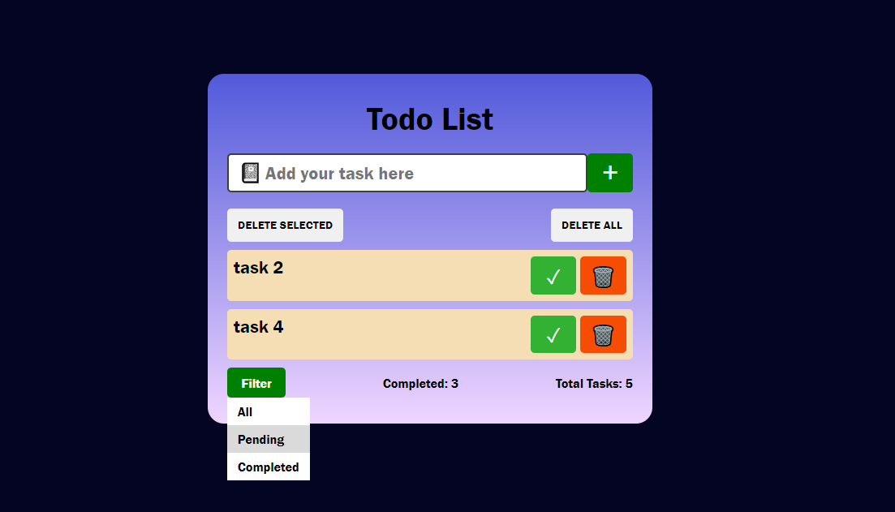
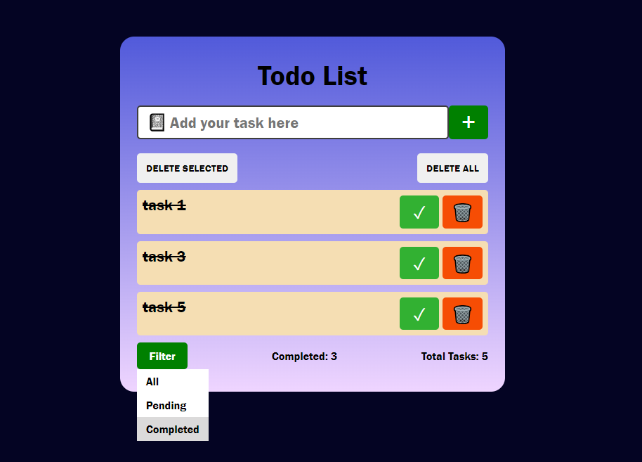

# Todo List App 📝

<p align="center">
  
</p>

A simple and intuitive Todo List application built using HTML, CSS, and JavaScript. The app allows users to manage their tasks efficiently with features like adding, removing, marking tasks as done, and filtering tasks based on completion status.

## Features

- **Add Tasks:** Easily add new tasks to your todo list.
- **Remove Tasks:** Delete tasks when they are no longer needed.
- **Mark as Done:** Mark tasks as completed with a single click.
- **Filter Tasks:** Filter tasks to view all tasks, completed tasks, or pending tasks.

## Technologies Used


## Demo

Check out the live demo of the Todo List App [here](https://idhruv11.github.io/To-Do-List/).

## Screenshots




## Getting Started

To get a local copy up and running follow these simple steps:

### Prerequisites

- Clone the repository
  ```bash
  git clone https://github.com/idhruv11/todo-list-app.git
