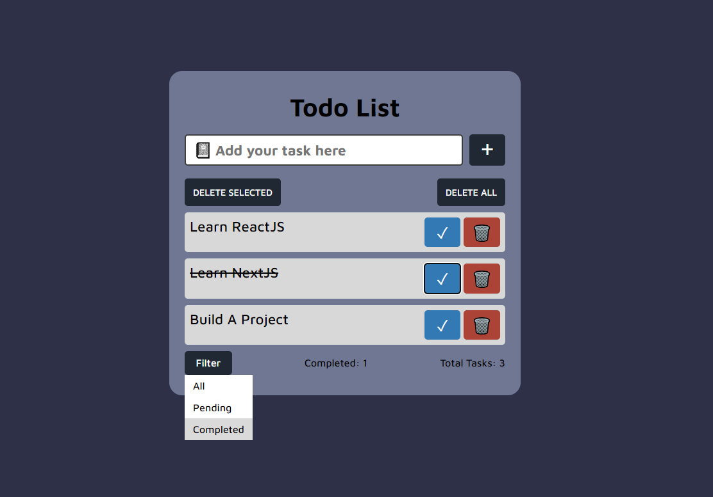

# To-Do List Application

A simple and efficient To-Do List application that helps you manage your tasks effectively. This application allows you to add, delete, and filter tasks based on their status (Pending, Done, or All).

## Features

- **Add Task**: Quickly add tasks to your list with a user-friendly input.
- **Delete Task**: Remove tasks that are no longer needed with a simple delete button.
- **Filter Tasks**: 
  - View **All Tasks**: See all tasks regardless of their status.
  - View **Pending Tasks**: Focus on tasks that are yet to be completed.
  - View **Completed Tasks**: Review tasks that have been marked as done.

## Screenshots

## Tech Stack

- **HTML5**: Structuring the content of the application.
- **CSS3**: Styling the application with custom designs.
- **JavaScript**: Adding interactivity and managing the application logic.

